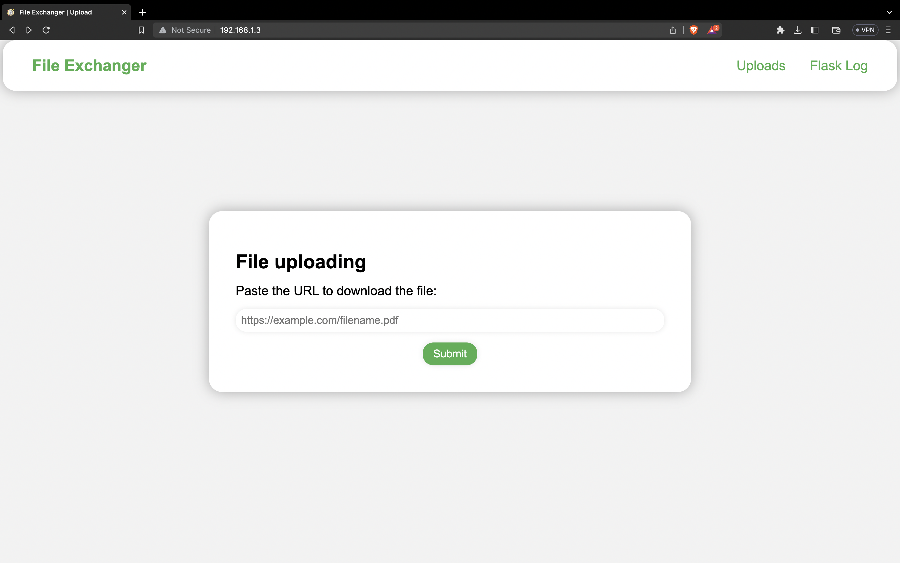
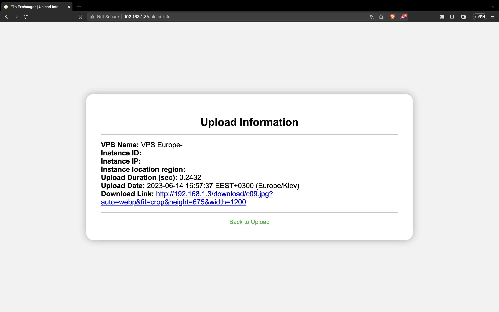
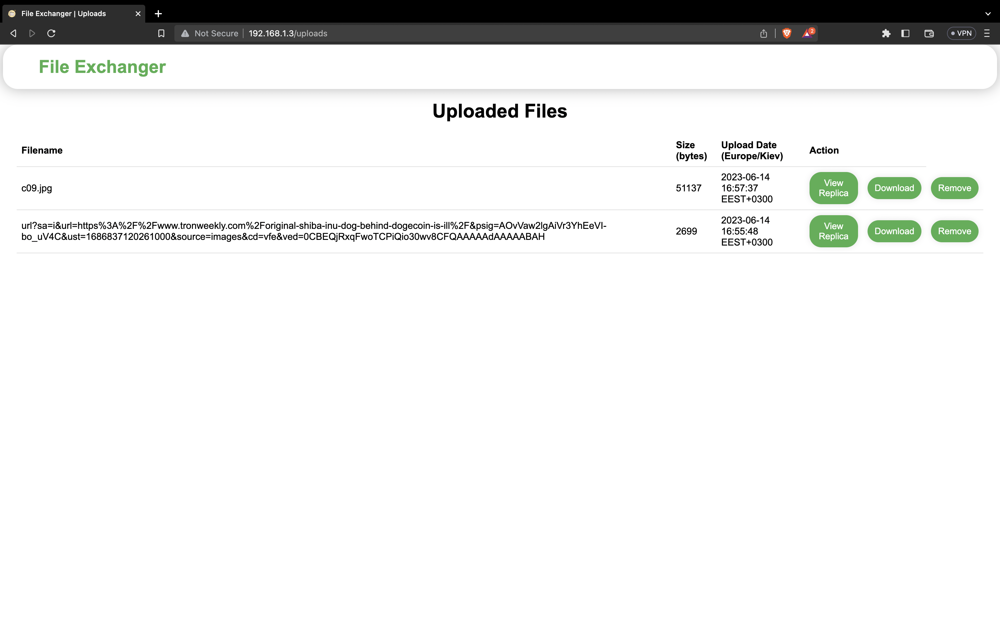
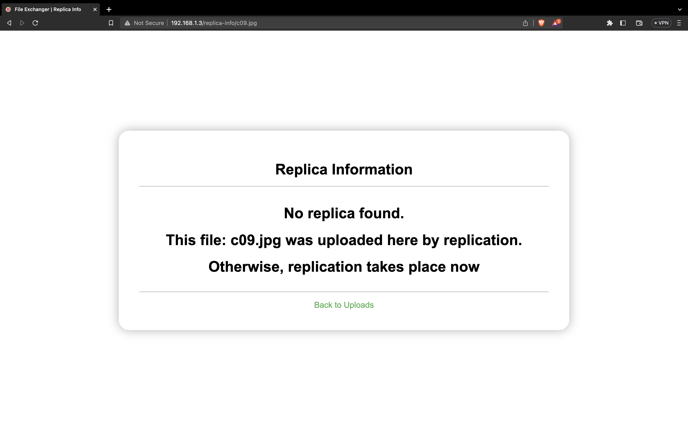
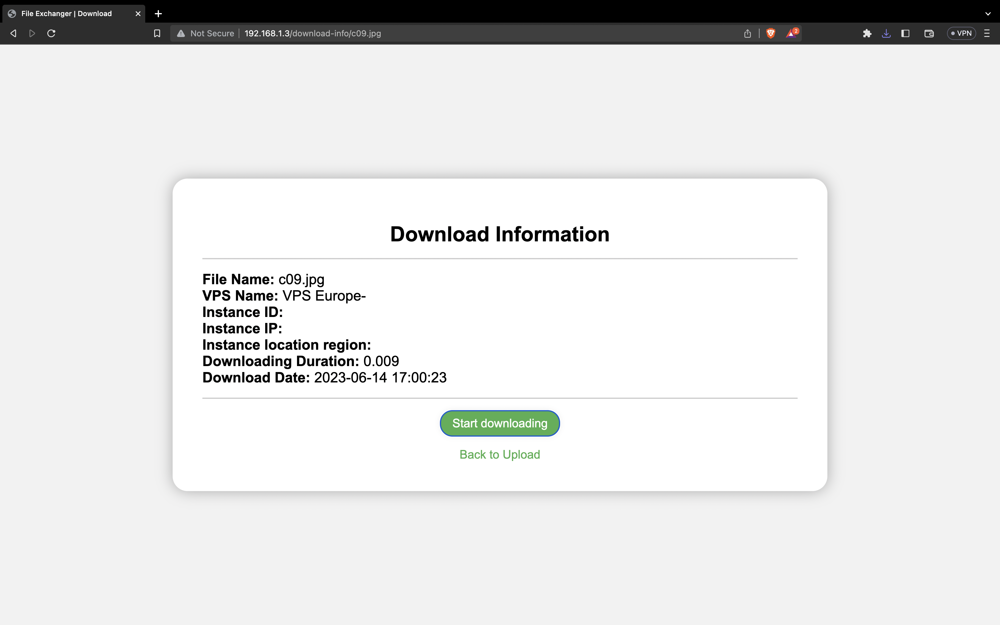

# File Exchanger

## Description

File Exchanger is a web application that allows users to easily download files by providing a URL. The application automatically determines the user's location and stores the downloaded file on the nearest server for faster access. Additionally, once the file is downloaded successfully, it is automatically replicated to other servers for improved redundancy and availability.


## Features
1. **Download Files**: Users can provide the URL of the file they want to download through the web interface.
2. **Automatic Server Selection**: Based on the user's location, the application determines the nearest server to store the downloaded file for faster access.
3. **Replication**: Once a file is successfully downloaded, it is automatically replicated to other servers for improved redundancy and availability.
4. **Download from Nearest Server**: Users can choose to download the file from the nearest server, ensuring faster download speeds.
5. **Basic File Data**: Users can view basic information about the downloaded file, such as its name, size, and format.
6. **Removal**: Users have the option to remove the downloaded file from the server.

## Technologies Used
1. **Python**: The core programming language used for building the application's backend logic.
2. **HTML, CSS, JS**: These web technologies are used for designing and implementing the user interface.
3. **Flask**: A Python web framework used for building the application's backend and handling HTTP requests.
4. **Celery**: A distributed task queue system used for asynchronous file replication to other servers.
5. **Redis**: An in-memory data structure store used as a message broker for Celery and for caching frequently accessed data.
6. **GeoDNS**: A technology that dynamically resolves DNS requests based on the user's geographical location, allowing for efficient server selection.

## Installation and Setup
To run the File Exchanger application locally, follow these steps:

1. Clone the repository from GitHub: https://github.com/Puckipsi/FileExchanger.git
2. Install Python (version 3.9 or higher) and ensure it's added to your system's PATH.

## Launching the Application from a Virtual Environment (venv)
To ensure a clean and isolated environment for the application, you can use a virtual environment (venv). Follow these steps to set up and launch the application within a venv:

1. Create a new virtual environment in app directory by running the following command in the project's root directory:
   ```shell
   python3 -m venv myenv
   ```

2. Activate the virtual environment:
   - On Windows:
     ```shell
     myenv\Scripts\activate
     ```
   - On macOS and Linux:
     ```shell
     source myenv/bin/activate
     ```

3. Install the required Python packages within the virtual environment:
   ```shell
   pip3 install -r requirements.txt
   ```

4. Set up Redis by following the installation instructions for your operating system: https://redis.io/docs/getting-started/installation/

5. Configure the application settings in the `.env` file according to your environment.

6. Launch the application from within the virtual environment:
   ```shell
   python3 app.py
   ```

7. Open a web browser and access the application at [http://localhost:80].

Certainly! Here's an updated section that includes instructions for setting up and running the application on a server using a shell script:

## Setup and Running the Application on a Server via Shell Script

To simplify the setup and deployment process, you can use a shell script to automate the necessary steps for running the File Exchanger application on a server. Follow these steps:

1. Access the server via SSH or any other remote connection method. Navigate to the project directory on the server using the terminal.
2. Read and execute manual commands in the shell script file `setup.sh`.
3. Run the shell script by executing the following command:

   ```bash
   bash setup.sh
   ```

   The script will activate the virtual environment, install the required packages, configure the application, and finally, run the application.

## File Exchanger Screenshots

These screenshots provide a visual representation of the different screens and functionalities available in the File Exchanger application.

### Start Page - Uploading File


On the start page, users can paste the URL of the file they want to download. They can then click on the "Upload" button to initiate the file upload process.

### Uploaded File Info


After the file is uploaded successfully, users are presented with a screen displaying information about the uploaded file. This information includes the instance ID, region, and name (if it's not a local server). The screen also provides the time taken to upload the file, including the duration specific to the region.

### Uploads Page - Live Files and Options


On the uploads page, users can see the list of live files available for download. Each file is accompanied by options such as "Download," "Delete," and "View Replicas." Users can select the desired action for each file as needed.

### File Replication Information

When users choose to view replicas for a file, they are presented with a screen displaying information about the file replication. This includes the number of replicas, their locations (regions), and any relevant details about their status or synchronization.
However, in the provided screenshot, it can be observed that replication is not running for this file because the server is a local server. Replication typically occurs when the application is deployed on multiple servers across different regions.

### Download Screen


When users choose to download a file, they are redirected to the download screen. Here, they can track the progress of the download and view relevant information such as the file size, remaining time, download speed, etc.

### Display Downloaded File


Once the file is successfully downloaded, users can view the downloaded file directly in the browser.


## License
The File Exchanger application is open-source and released under the [MIT License](LICENSE).
